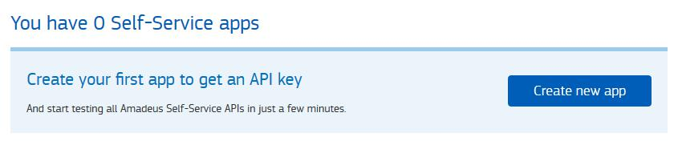
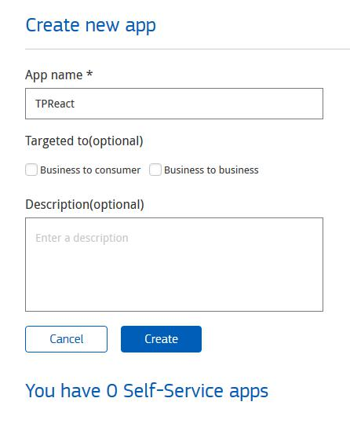
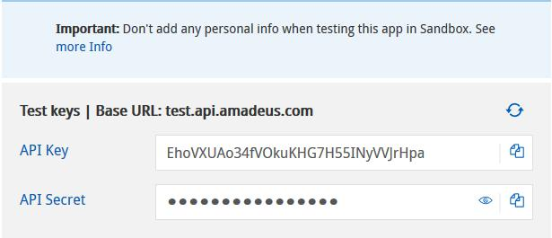

# API - Project

* Generate a page according to the mockup model, both mobile and desktop (real example: https://screeching-field.surge.sh/).
* The API to extract the information is:
https://developers.amadeus.com/self-service/category/air/api-doc/flight-offers-search
* To use the API, you need to create an API Key and an API Secret.
  1. Create an account by going to https://developers.amadeus.com/register
  2. Once the account is created (after verifying the email account), we enter the profile: https://developers.amadeus.com/my-apps
  3. Let's see the following:

4. Click on the button **Create new app**
  5. Complete the form data, and press the button **Create**

  6. Once the application has been created, a screen will appear with the API Keys we need:

  7. We copy and save BOTH data, since we will need them later.
* The screens that we are going to have are the following:
  1. Home, with search form: [Home Desktop](./vistas/desktop_1_home.png)
  2. List of results: [Desktop search result](./views/result.png)
  3. Flight detail: [Checkout Desktop](./vistas/checkout.png)

## API Description
When we go to the results page, we need to fetch the Amadeus API. The URL we are going to use is:
```js
https://test.api.amadeus.com/v2/shopping/flight-offers?originLocationCode=${iataOrigin}&destinationLocationCode=${iataDest}&departureDate=${fromDate}&returnDate=${toData}&adults=${adults}&max=50
```
* **iataOrigin**: is the code of the city, country or airport from which we travel, in IATA format https://en.wikipedia.org/wiki/IATA_airport_code
* **iataDest**: is the code of the city, country or airport to which we are traveling, in IATA format https://en.wikipedia.org/wiki/IATA_airport_code
* **fromDate**: it is the date from which we want to travel, and it must have the format YYYY-MM-DD
* **toDate**: it is the return date, when we want to buy a return flight, also in YYYY-MM-DD format. If the trip is only one way, **we don't have to add the parameter in the URL**.
* **adults**: is the number of passengers that are going to travel, which cannot be more than 8

### Requerimientos
* SASS
* HTML
* JS

```css
font-family: 'Roboto', sans-serif;
```
```html
<link href="https://fonts.googleapis.com/css?family=Roboto:300,400,500&amp;subset=cyrillic" rel="stylesheet">
```
